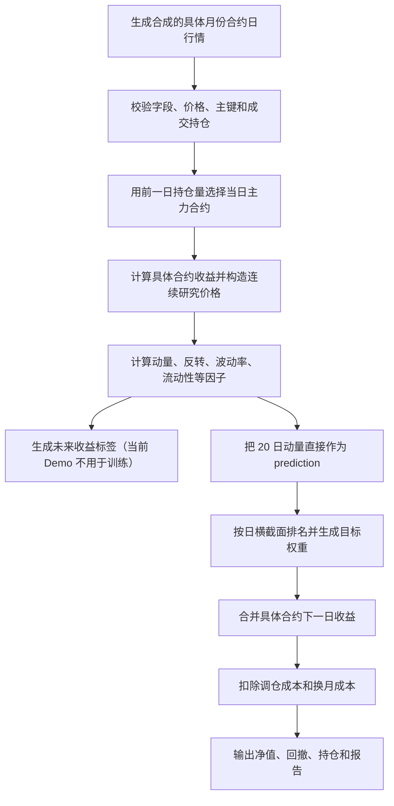

# 中国商品期货机器学习因子项目：当前进度与团队统一认知

> 文档版本：`v1.0`  
> 进度快照日期：2026-07-21  
> 项目版本：`0.1.0`  
> 适用对象：第一次接触期货、因子投资、机器学习和 Python 工程的团队成员  
> 本文目的：让所有成员对“项目在研究什么、代码已经做到哪里、下一步缺什么”形成同一套认识

---

## 0. 先读这一页：当前项目到底处于什么阶段

### 0.1 一句话结论

当前项目已经完成了一个**可以运行、可以检查、可以扩展的教学级量化研究骨架**：它能用合成的中国商品期货数据，依次完成数据校验、主力合约选择、连续序列构造、基础因子计算、横截面多空组合、调仓与换月成本回测以及报告生成。

但是，当前项目**还不是一套已经训练好的 AI 投资策略，更不是实盘交易系统**。

### 0.2 当前真正运行的策略

当前 Demo 实际运行的是：

```text
过去 20 日动量
    ↓ 直接作为 prediction 分数，不训练模型
每天比较 6 个合成商品品种
    ↓
买入分数最高的一组，卖空分数最低的一组
    ↓
按等权构造多空组合
    ↓
使用具体月份合约的下一日结算价收益计算盈亏
    ↓
扣除简化调仓成本和换月成本
```

因此，当前 Demo 不能表述为“LightGBM 策略”“XGBoost 策略”“神经网络策略”或“GNN 策略”。准确说法是：

> 当前已经完成基础因子策略和机器学习可插拔接口；LightGBM、XGBoost、神经网络和图神经网络仍属于后续研究任务。

### 0.3 当前进度总览

本文统一使用四种状态：

| 状态 | 含义 |
|---|---|
| ✅ 已完成 | 已有可运行代码，并至少有基础验证或产物 |
| 🟡 部分完成 | 已有部分代码或简化实现，但不能按正式研究标准使用 |
| ⬜ 未开始 | 当前没有对应核心实现 |
| 📘 仅规划 | 文档、配置或接口提到过，但不能因此宣称功能已经实现 |

| 项目部分 | 当前状态 | 简要说明 |
|---|---:|---|
| 独立 Python/Conda 工程 | ✅ | 环境、包、命令行和目录已经建立 |
| 合成期货数据 | ✅ | 6 个品种、重叠月份合约，可演示换月 |
| 上财导出文件接入 | ✅ | 支持 CSV、Excel、Parquet 和字段映射 |
| 真实全市场数据 | ⬜ | 尚未取得和形成正式研究数据集 |
| 基础数据校验 | ✅ | 检查关键字段、重复、价格和成交持仓异常 |
| 主力合约选择 | ✅ | 使用前一日持仓量，不允许交割月份倒退 |
| 连续研究价格 | ✅ | 用合约自身收益连乘，避免直接拼价跳点 |
| 基础因子 | ✅ | 动量、反转、波动率、流动性、持仓变化 |
| 期货期限结构等正式因子 | ⬜ | Carry、基差、曲线斜率等尚未实现 |
| 未来收益标签 | 🟡 | 有演示标签，但正式可交易跨换月标签仍需重做 |
| 当前预测模型 | ✅ | 仅有无需训练的单因子基线 |
| 线性回归/Ridge | ⬜ | 尚未实现正式训练和滚动验证 |
| LightGBM/XGBoost | 📘 | 依赖和接口已预留，模型尚未实现 |
| 神经网络/GNN | 📘 | 研究路线中有规划，尚未实现 |
| 横截面多空组合 | ✅ | 高分组做多、低分组做空、等权分配 |
| 波动率缩放/板块中性/风控 | ⬜ | 尚未实现 |
| 简化调仓成本 | ✅ | 用权重变化乘统一基点成本 |
| 简化换月成本 | ✅ | 主力切换时对原持仓额外扣费 |
| 独立滑点模型 | ⬜ | 没有按买卖价差、最小价位或成交量建模 |
| 涨跌停不可成交 | ⬜ | 字段存在，但回测没有使用 |
| 合约乘数、整数手数、保证金 | ⬜ | 当前使用抽象组合权重，不是实际手数账户 |
| 绩效指标和报告 | ✅ | 净值、回撤、Sharpe、成本、换手等 |
| 自动测试 | ✅ | 当前 8 项测试通过 |
| 正式样本外实验 | ⬜ | 尚未建立训练/验证/测试滚动实验系统 |

### 0.4 目前能说和不能说的话

可以说：

- 项目工程骨架已经能够端到端运行；
- 当前已经统一了 Demo 的主力合约选择和连续序列口径；
- 当前回测已经扣除简化调仓成本和简化换月成本；
- 项目已经为未来机器学习模型预留统一接口；
- 合成数据可以验证程序流程和换月逻辑。

不能说：

- “LightGBM、XGBoost、神经网络和 GNN 已经完成”；
- “当前策略已经证明可以盈利”；
- “项目已经使用真实中国商品期货数据”；
- “当前回测完整模拟了涨跌停、滑点、保证金和真实手续费”；
- “合成数据上的收益说明模型有效”；
- “字段表里有涨跌停价，所以涨跌停约束已经落实”。

---

## 1. 项目想回答的研究问题

本项目最终希望回答：

> 中国商品期货的动量、反转、期限结构、持仓、流动性、波动率及品种关联等特征，能否预测不同商品未来的相对收益？机器学习能否在严格样本外验证、统一组合规则和完整交易成本后，稳定优于传统单因子、等权多因子和线性模型？

这里有三个关键词。

### 1.1 “预测未来收益”，不是主要预测绝对价格

铜、螺纹钢、豆粕和白糖的价格单位与数量级不同。直接比较它们未来“涨多少元”没有意义。项目更适合预测：

- 未来 1 日、5 日或 20 日收益率；
- 未来收益方向；
- 同一天各品种未来相对强弱排名。

例如，模型可能输出：

| 品种 | `prediction` | 含义 |
|---|---:|---|
| CU 铜 | 0.031 | 在当天品种中相对看强 |
| RB 螺纹钢 | 0.014 | 次强 |
| SR 白糖 | -0.006 | 偏弱 |
| M 豆粕 | -0.024 | 相对最弱 |

这些数首先被用作**排序分数**，不应解释成精确承诺“铜一定上涨 3.1%”。

### 1.2 “横截面”，是同一天比较不同品种

当前策略不是只判断一个品种明天涨还是跌，而是在同一天比较多个品种：

```text
预测较强的一组 → 做多
预测较弱的一组 → 做空
处于中间的一组 → 不持仓
```

这种方式称为横截面多空策略。它试图赚取“强品种相对弱品种”的差异，并不代表组合完全没有市场风险。

### 1.3 “样本外、成本后”，才有研究意义

一个模型在训练数据上表现很好并不稀奇。可信的结论至少需要：

- 测试期没有参与训练和调参；
- 训练、验证、测试按时间顺序划分，不能随机打乱；
- 所有模型使用同一数据、标签、组合和成本；
- 报告扣费后而不只是扣费前收益；
- 对不同时间、品种、换月规则和成本假设做稳健性检验。

这些正式机器学习实验设施目前尚未实现，是下一阶段的核心工作。

---

## 2. AI 模型、投资策略和仓位管理分别负责什么

这是最容易产生误解的地方。项目将职责拆成三层。

### 2.1 预测层：模型回答“谁更可能强”

模型的输入可以包括：

- 历史动量和反转；
- 波动率；
- 成交量和持仓量；
- 流动性；
- 期限结构和展期收益；
- 库存、现货、天气或宏观数据；
- 不同品种之间的产业链关系。

模型输出统一命名为 `prediction`。组合层不需要知道它来自单因子、LightGBM 还是神经网络。

### 2.2 组合层：把预测变成目标仓位

组合层回答：

- 买哪些品种；
- 卖空哪些品种；
- 每个品种目标权重是多少；
- 总多头、总空头和总杠杆是多少；
- 是否需要波动率缩放、板块中性或仓位上限。

当前只实现了最简单的横截面等权多空：多头合计 `+0.5`，空头合计 `-0.5`，组合毛敞口为 `1.0`。

### 2.3 执行与回测层：决定能否成交和真实赚亏

执行层应该回答：

- 今天具体交易哪个月份合约；
- 是否发生换月；
- 目标仓位能否在涨跌停状态下成交；
- 实际成交多少手；
- 手续费、滑点和冲击成本是多少；
- 保证金是否足够；
- 未成交订单和旧仓位如何处理。

当前项目只完成了其中一部分：具体合约映射、简化换月成本和百分比权重收益。涨跌停、整数手数、保证金和真实撮合尚未完成。

### 2.4 不同模型在本项目中的合理位置

| 方法 | 主要作用 | 是否直接决定交易规则 | 当前状态 |
|---|---|---:|---:|
| 单因子排序 | 直接把某个因子当作强弱分数 | 否 | ✅ Demo 已使用 |
| 线性回归/Ridge | 学习多个因子的线性组合 | 否 | ⬜ |
| LightGBM | 学习非线性和因子交互 | 否 | 📘 |
| XGBoost | 学习非线性和因子交互 | 否 | 📘 |
| MLP | 学习一般非线性关系 | 否 | 📘 |
| LSTM/GRU | 学习一段历史序列的动态 | 否 | 📘 |
| 图神经网络 | 学习品种关系和联动传播 | 否 | 📘 |

图神经网络可以利用“原油—化工”“铁矿石—钢材”“大豆—豆粕—豆油”等关系，但它仍应输出预测分数。主力合约、涨跌停、成本和仓位限制不能交给模型各自随意处理。

---

## 3. 当前量化交易方式的完整结构

### 3.1 当前 Demo 数据流



### 3.2 每一步的输入、输出和完成程度

| 步骤 | 输入 | 输出 | 当前实现 |
|---|---|---|---:|
| 1. 数据生成/接入 | 合成参数或本地文件 | 具体月份合约日行情 | ✅ |
| 2. 标准化 | 数据商字段 | 项目统一字段 | ✅ |
| 3. 质量检查 | 标准行情 | 错误/警告报告 | ✅ 基础版 |
| 4. 主力选择 | 所有月份合约 | 每日品种—实际合约映射 | ✅ |
| 5. 连续序列 | 主力日历和具体合约行情 | 连续收益、连续价格 | ✅ |
| 6. 因子 | 连续面板 | 多列因子 | ✅ 基础版 |
| 7. 标签 | 连续研究价格 | 1/5/20 日未来收益 | 🟡 演示版 |
| 8. 模型 | 因子 | `prediction` | ✅ 仅单因子基线 |
| 9. 组合 | `prediction` | 目标权重 | ✅ 简化版 |
| 10. 执行 | 目标权重和市场状态 | 实际仓位 | ⬜ 尚未独立实现 |
| 11. 回测 | 权重、具体合约收益、成本 | 日收益和净值 | 🟡 教学版 |
| 12. 评价 | 回测结果 | 指标、图表、报告 | ✅ 基础版 |

### 3.3 当前信息时间线

代码当前采用的概念时间线是：

```text
t 日收盘/结算数据完成
→ 计算 t 日因子
→ 形成 t 日权重
→ 获得所选具体合约从 t 到 t+1 的收益
```

这个时间线适合验证工程接口，但正式研究需要更加保守。因为如果因子使用了完整的 `t` 日结算信息，就不能又假设自己已经无摩擦地按同一个 `t` 日结算价成交。

正式研究建议采用：

```text
t 日收盘后获得完整信息并产生信号
→ t+1 日按预先定义的开盘价、VWAP 或其他可交易价格成交
→ 从实际成交之后开始计算持有收益
```

至少还应做“所有信号延迟 1 个交易日”的敏感性检验。当前 Demo 的收益不能直接作为正式样本外结论。

---

## 4. 期货项目最重要的特殊问题

### 4.1 品种和合约不是一回事

“螺纹钢 RB”是一个品种；`RB2605`、`RB2610` 是不同到期月份的可交易合约。

模型通常希望每个交易日对“螺纹钢这个品种”产生一个预测，但真实交易必须落到某一份具体月份合约。这个转换就是主力合约和换月问题。

### 4.2 为什么必须统一主力合约规则

如果不同模型使用不同主力合约，模型比较就不公平。例如：

- 单因子使用持仓量最大合约；
- LightGBM 使用成交量最大合约；
- XGBoost 使用数据商主力连续指数；
- GNN 使用近月合约。

此时收益差异可能来自合约选择，而不是模型能力。

因此，所有模型必须共享同一份预先生成的研究面板和主力合约日历。模型只读取公共数据，不自己重新拼接合约。

### 4.3 当前主力合约规则

当前配置为：

```yaml
main_contract:
  selector: open_interest
  selector_lag: 1
  prevent_delivery_month_rollback: true
```

含义是：

1. 在交易日 `t`，使用各合约 `t-1` 日持仓量；
2. 选择持仓量最大的合约作为 `t` 日主力；
3. 已经切到更远交割月后，默认不再退回更早月份；
4. 合约变化时写入 `previous_contract` 和 `is_roll_day`。

使用前一日持仓量是为了避免用当天收盘后才完整知道的信息，去假装决定当天更早的交易。

当前仍缺少：

- 距离最后交易日若干天强制换月；
- 新合约最短上市历史；
- 主力切换连续确认或缓冲带；
- 每次换月原因和价格差审计表；
- 持仓量规则与成交量规则的稳健性比较；
- 数据商特殊合约代码和品种规则的完整适配。

### 4.4 为什么不能直接把不同合约价格首尾相接

假设旧合约最后价格是 100，新合约同时价格是 105。第二天主力切到新合约时，如果把价格直接连接，就会产生一个看似 `+5%` 的跳升。

但这 5% 可能只是两个到期月份原本存在的价差，不是策略一天真正赚到的收益。

当前项目采用：

```text
先计算每份具体合约自己的日收益
→ 每天取当日选中主力合约的自身收益
→ 将收益连乘成从 100 开始的 continuous_close
```

`continuous_close` 是研究指数，用于计算动量和波动率，不是市场上真实存在、可以直接成交的价格。

### 4.5 研究连续价格与真实盈亏必须分开

| 数据 | 主要用途 | 能否直接当成交价 |
|---|---|---:|
| `continuous_close` | 计算因子、画长期趋势 | 否 |
| 具体合约 `settlement` | 计算具体合约收益 | 在当前教学假设下使用 |
| 未来真实执行价 | 正式策略成交与滑点 | 当前尚未接入 |

当前回测的 `forward_return` 是当日选中具体合约从 `t` 到 `t+1` 的结算价收益，而不是连续指数的跳点收益。

### 4.6 换月成本是什么意思，当前怎样计算

假设组合一直持有螺纹钢多头，主力从 `RB2605` 切到 `RB2610`。即使“螺纹钢权重”没有变化，也需要：

1. 平掉旧合约；
2. 建立新合约；
3. 支付手续费、买卖价差和可能的市场冲击。

当前项目在 `is_roll_day=True` 时，按上一日仓位绝对值计算额外换月换手，并乘统一的 `roll_bps`。默认配置：

```yaml
rebalance_bps: 5.0
roll_bps: 3.0
```

当前每日净收益概念上为：

```text
毛收益
- 普通权重变化 × 5 bps
- 主力换月持仓 × 3 bps
= 净收益
```

这只是统一基点成本近似，尚未区分按手手续费、成交额费率、平今/平昨、买卖价差、合约乘数和不同历史费率。

### 4.7 涨跌停限制是什么意思

涨跌停不只是“当天收益不能超过某个百分比”，更重要的是**策略可能无法成交**。

将仓位变化记为 `目标仓位 - 现有仓位`：

| 市场状态 | 通常困难的交易方向 | 例子 |
|---|---|---|
| 封涨停 | 买入 | 开多、加多、平空 |
| 封跌停 | 卖出 | 开空、加空、平多 |

例如模型要求平掉某品种多头，但该合约封死跌停。真实情况下卖单可能无法成交，账户仍然保留旧多头并继续承担风险。回测不能把“目标仓位”直接当成“实际仓位”。

换月时还有两条腿：平旧合约和开新合约。任何一条腿无法成交，都可能导致换月失败、部分成交或暂时保留跨合约风险。

### 4.8 当前涨跌停是否已经落实

**没有。**

当前数据契约和合成数据中虽然有 `upper_limit`、`lower_limit`，但回测器没有读取这些字段，也没有维护：

- 交易前实际仓位；
- 目标仓位；
- 可成交数量；
- 未成交数量；
- 成交后实际仓位；
- 因涨跌停失败的换月订单。

所以“有字段”只代表未来具备输入位置，不代表规则已经进入收益计算。

正式实现还要先确定日频数据下的保守判定，例如：

- 只有触及涨跌停，还是全天单边封板才认为不可成交；
- 使用 `high == low == upper_limit/lower_limit`，还是数据商直接提供停板状态；
- 有成交量时是否允许部分成交；
- 旧合约和新合约分别受限时怎样处理换月。

规则必须先写成研究协议，再编码并用手工小样本测试。

### 4.9 目标仓位和实际仓位是后续必须分开的两个概念

```text
模型 prediction
→ 组合层生成 target_weight（想持有多少）
→ 执行层检查涨跌停、流动性、整数手数和保证金
→ 生成 executed_weight / actual_position（实际持有多少）
→ 回测使用实际持仓计算盈亏
```

当前 `positions.csv` 中的 `weight` 实质上是目标权重，并被回测直接视为已成交权重。这是教学简化，正式报告必须说明。

---

## 5. 当前代码中的计算方法

### 5.1 因子

当前启用六个基础因子：

| 因子 | 直观含义 | 当前用途 |
|---|---|---|
| `momentum_20` | 过去 20 日涨跌幅 | 当前 Demo 主信号 |
| `momentum_60` | 过去 60 日涨跌幅 | 已计算，未作为 Demo 主信号 |
| `reversal_5` | 过去 5 日收益的相反数 | 已计算 |
| `volatility_20` | 过去 20 日日收益的年化波动 | 已计算 |
| `liquidity_20` | 过去 20 日平均成交量的对数 | 已计算 |
| `open_interest_change_20` | 过去 20 日主力持仓量变化 | 已计算，换月附近需谨慎 |

当前没有正式实现：

- 近远月价差和期限结构；
- 展期收益/Carry；
- 基差；
- 库存、现货、天气和宏观因子；
- 产业链跨品种因子；
- 因子横截面标准化、去极值和中性化；
- 系统化单因子 IC 和分组检验。

### 5.2 标签

当前生成：

```text
target_return_1d
target_return_5d
target_return_20d
```

计算方式是未来连续研究价格除以当前连续研究价格再减 1。它们目前只是演示数据列，当前单因子模型没有调用 `fit()`，也没有拿这些标签训练。

正式机器学习前必须重新审计标签，尤其要回答：

- 5 日或 20 日内发生换月时，标签是否对应可执行的滚动路径；
- 标签的进入价是否晚于信号信息时间；
- 涨跌停无法成交或换月时怎样处理；
- 标签期限是否与持有期、调仓频率一致；
- 训练和验证边界是否留出至少标签长度的隔离区。

### 5.3 当前模型

当前 `IdentityFactorModel` 不训练参数，只执行：

```text
prediction = momentum_20
```

`ResearchModel` 只规定未来模型都必须支持：

- `fit(features, target)`；
- `predict(features)`。

接口存在不等于模型已经存在。

### 5.4 当前组合规则

每个交易日：

1. 删除预测缺失的品种；
2. 按 `prediction` 从高到低排序；
3. 取最高比例做多；
4. 取最低比例做空；
5. 多头总权重为 `+gross_exposure/2`；
6. 空头总权重为 `-gross_exposure/2`；
7. 其他品种权重为零。

Demo 有 6 个品种，当前配置的多头和空头比例都是 `34%`，最低有效品种数为 3。

### 5.5 当前收益和成本

品种毛收益贡献：

```text
weight × forward_return
```

普通调仓换手分量：

```text
abs(当日权重 - 上一日权重) / 2
```

换月换手分量：

```text
若 is_roll_day：abs(上一日权重)
否则：0
```

组合净收益：

```text
各品种毛收益贡献之和
- 普通调仓换手 × rebalance_bps
- 换月换手 × roll_bps
```

这里的 `rebalance_bps` 可以被理解为统一打包的交易摩擦近似，但当前没有把手续费与滑点分别估计，也没有容量和市场冲击模型。

---

## 6. 工程结构：每个目录和模块负责什么

### 6.1 顶层目录

```text
cn-futures-factor-lab/
├── configs/       研究参数和数据字段映射
├── data/          原始、中间和处理后数据
├── docs/          团队文档、方法和路线图
├── notebooks/     探索、画图和讲解，不保存核心逻辑
├── src/           可复用的正式 Python 代码
├── tests/         自动测试
├── artifacts/     报告、净值、持仓等运行产物
├── environment.yml
├── pyproject.toml
├── Makefile
└── README.md
```

### 6.2 核心源码结构

```text
src/cn_futures_factor/
├── cli.py                    命令行：doctor、demo、ingest
├── config.py                 读取 YAML 配置
├── paths.py                  统一项目路径
├── exceptions.py             项目自定义错误
├── logging.py                日志配置
├── data/
│   ├── connectors/           CSV、Excel、Parquet、上财导出文件接入
│   ├── normalization.py      字段改名、类型和单位标准化
│   ├── validation.py         数据质量检查
│   ├── storage.py            Parquet 原子写入和 manifest
│   ├── schema.py             标准数据字段
│   └── synthetic.py          合成期货数据生成器
├── futures/
│   ├── contracts.py          合约代码和交割年月解析
│   ├── main_contract.py      主力合约选择
│   └── continuous.py         连续序列和具体合约收益
├── features/
│   ├── base.py               因子定义接口
│   ├── technical.py          各个基础因子公式
│   └── pipeline.py           按配置统一计算因子
├── labels/
│   └── forward_returns.py    未来收益标签
├── models/
│   ├── base.py               模型统一接口
│   └── baseline.py           当前单因子基线
├── portfolio/
│   └── construction.py       预测分数转目标权重
├── backtest/
│   └── engine.py             收益、换手和成本回测
├── evaluation/
│   ├── metrics.py            绩效指标
│   └── report.py             图表和 Markdown 报告
└── pipelines/
    └── demo.py               把全部步骤串成 Demo
```

### 6.3 为什么要分层

如果以后加入 LightGBM，只应该替换“模型输出 prediction”这一部分，而不应复制一套新的主力合约和回测代码。

分层的目标是：

```text
所有模型共享数据和交易规则
→ 只比较模型预测能力
→ 修复一次换月或成本逻辑，所有模型同时受益
→ 避免同一规则在多个 Notebook 中出现不同版本
```

### 6.4 配置文件

| 文件 | 作用 | 当前情况 |
|---|---|---|
| `configs/base.yaml` | 项目、Demo 和主力规则 | Demo 正在使用 |
| `configs/factors.yaml` | 启用因子、窗口和主信号 | Demo 正在使用 |
| `configs/backtest.yaml` | 组合和成本参数 | Demo 正在使用 |
| `configs/field_mappings.yaml` | 外部文件列名和单位映射 | ingest 正在使用 |
| `configs/universe.yaml` | 交易所、历史和流动性设想 | 🟡 当前 Demo 尚未真正应用其筛选规则 |

修改配置前，应记录修改原因。正式实验还需要新增数据版本、时间切分、预处理、模型和实验配置。

---

## 7. 数据目录和产物应该怎样理解

### 7.1 数据分层

| 目录 | 含义 | 是否可手工修改 |
|---|---|---:|
| `data/raw/` | 原始导出或合成原始数据 | 原则上只读保存 |
| `data/interim/` | 字段标准化后的中间数据 | 不手工修改 |
| `data/processed/` | 可供研究使用的面板、因子和标签 | 由程序生成 |
| `artifacts/` | 持仓、收益、图表和报告 | 由程序生成，可重建 |

真实授权数据不能提交到公开仓库，也不能发送给没有权限的成员。

### 7.2 当前已有 Demo 产物

| 文件 | 内容 |
|---|---|
| `data/raw/demo_contract_daily.csv` | 合成的具体月份合约日行情 |
| `data/processed/demo_contract_daily.parquet` | 处理后的合约行情 |
| `data/processed/demo_main_panel.parquet` | 主力合约和连续研究面板 |
| `data/processed/demo_features.parquet` | 因子和未来收益标签 |
| `artifacts/demo/positions.csv` | 每日品种权重、实际合约和收益贡献 |
| `artifacts/demo/daily_returns.csv` | 每日毛收益、成本、净收益和净值 |
| `artifacts/demo/equity_curve.png` | 净值和回撤图 |
| `artifacts/demo/report.md` | 合成数据演示报告 |

当前报告包含约 498 个有效回测日，但所有数据都是程序生成的。收益率、Sharpe 和最大回撤只用于确认程序计算链路没有中断，不能用来选择真实投资策略。

### 7.3 Manifest 的用途

真实文件通过 `ingest` 导入时会生成 `.manifest.json`，记录：

- 原始文件路径；
- SHA-256 文件摘要；
- 导入时间；
- 行数和字段；
- 起止日期；
- 字段映射和校验摘要。

团队出现结果不一致时，应先比较数据摘要，而不是立即争论模型参数。

---

## 8. 当前测试、代码质量和可复现状态

### 8.1 2026-07-21 本机检查结果

在项目专用环境 `cn-futures-factor` 中运行：

```bash
pytest -q
ruff check .
```

结果：

```text
8 passed
All checks passed!
```

### 8.2 当前测试覆盖了什么

| 测试 | 验证内容 |
|---|---|
| `test_contracts.py` | 四位/三位合约代码解析和非法月份报错 |
| `test_main_contract.py` | 主力选择使用前一日持仓量 |
| `test_no_lookahead.py` | 添加未来数据不会改变过去因子值 |
| `test_validation.py` | 合成数据校验和重复主键拦截 |
| `test_demo_pipeline.py` | Demo 端到端生成报告、图表、持仓和净值 |

### 8.3 当前测试没有覆盖什么

以下关键测试尚不存在：

- 手工验证连续价格在换月日没有虚假跳点；
- 手工验证换月成本金额；
- 涨停买不进、跌停卖不出的执行测试；
- 旧合约无法平仓或新合约无法开仓的换月测试；
- 合约临近到期强制换月测试；
- 1/5/20 日标签与真实持有路径一致性测试；
- 训练、验证、测试边界及隔离区测试；
- 预处理参数不使用未来数据测试；
- 不同模型共享完全相同组合和成本的协议测试；
- 合约乘数、整数手数、保证金和品种级手续费测试。

因此，“测试通过”只能说明当前已测试范围通过，不能推导出正式交易规则已经完整。

---

## 9. 当前已经完成的工程成果

### 9.1 环境和命令行

已经具备：

```bash
cn-futures doctor
cn-futures ingest --input 文件 --mapping configs/field_mappings.yaml
cn-futures demo
pytest
ruff check .
```

其中：

- `doctor` 检查环境、依赖、配置和目录；
- `ingest` 导入授权环境中人工导出的本地数据；
- `demo` 用合成数据运行完整教学链路。

当前没有 `train`、`evaluate`、`compare` 等正式机器学习命令。路线图中出现这些名称时，它们是待实现目标，不是现有命令。

### 9.2 数据接入和治理

已实现：

- CSV、XLSX、XLSM、Parquet；
- 字段名映射；
- 日期、合约代码和数值类型处理；
- 成交量、持仓量、成交额单位倍数；
- 缺少 `pre_settlement` 时按具体合约历史推导；
- 标准化后数据校验；
- Parquet 原子写入；
- 数据来源 manifest。

仍需增加：

- 批量文件合并和去重；
- 上市日、最后交易日和历史合约规则校验；
- 每品种覆盖率、缺失率和异常分布报告；
- 真实数据人工抽样核对流程；
- 数据集版本号和冻结机制。

### 9.3 错误处理和可维护性

核心逻辑不依赖 Notebook；配置集中在 YAML；异常数据会明确报错；路径统一相对于项目根目录解析；写 Parquet 时先写临时文件再替换，降低中断造成损坏的风险。

这部分是工程基础，不代表金融方法已经全部完成。

---

## 10. 目前最重要的未完成事项和研究风险

### 10.1 P0：正式研究前必须完成

1. **取得并审计真实具体月份合约数据**  
   不能只使用数据商提供的主力连续指数；需要所有具体月份合约、结算价、成交量、持仓量和交易规则。

2. **冻结信息时间和成交时间**  
   明确信号何时可知、何时成交、用什么价格成交，避免同一结算价既产生信号又被假设为成交价。

3. **补全主力和到期规则**  
   加入临近最后交易日强制换月、新合约最低历史、换月确认和审计表。

4. **实现可交易标签**  
   未来 5/20 日跨换月收益必须沿可交易合约路径计算，并与真实持有期一致。

5. **实现目标仓位到实际仓位的执行层**  
   涨跌停、流动性、未成交、换月失败、整数手数和保证金都需要在这里处理。

6. **建立正式时间切分和防泄漏预处理**  
   训练、验证、测试按日期划分，边界预留标签期限隔离区；去极值、填补和标准化只在训练期估计。

7. **先做正式基准，再做复杂模型**  
   至少比较单因子、等权多因子、OLS/Ridge，然后再比较 LightGBM 和 XGBoost。

8. **统一成本和公平比较协议**  
   所有模型必须共享品种池、标签、预测到仓位规则、交易成本和评价指标。

### 10.2 当前回测的主要简化

| 简化 | 可能造成的偏差 |
|---|---|
| 使用合成数据 | 无法证明真实市场有效性 |
| 用结算价形成信号并计算后续收益 | 正式成交时点可能偏乐观 |
| 目标权重默认全部成交 | 忽略涨跌停和流动性 |
| 统一基点成本 | 忽略品种和历史费率差异 |
| 没有独立滑点模型 | 低估实际交易摩擦 |
| 没有整数手数和乘数 | 权重不能直接对应真实订单 |
| 没有保证金和逐日盯市 | 无法模拟资金占用和追保风险 |
| 没有容量限制 | 策略规模可能超过市场承载能力 |
| 没有板块中性和风险缩放 | 组合风险可能集中于高波动板块 |
| 5/20 日标签是连续指数演示标签 | 跨换月可交易性未充分表达 |

### 10.3 工程描述中容易引起误会的地方

- `pyproject.toml` 的 `ml` 依赖中列出 LightGBM/XGBoost，只表示可以安装，不表示模型已编码；
- `ResearchModel` 有统一接口，只表示未来能接模型，不表示已经训练；
- `upper_limit/lower_limit` 在字段字典中，只表示数据可以保存，不表示回测使用了它；
- README 中“滑点和换月成本”是总体目标表述，当前实际只有统一基点成本，没有独立滑点模型；
- `configs/universe.yaml` 已存在，但当前 Demo 的品种来自 `base.yaml`，流动性筛选尚未接入；
- 报告中有正收益只说明这一次合成路径的计算结果，不构成投资证据。

---

## 11. 后续工作路线和阶段门

完整任务已经写在 [07_后续研究任务与完整实验路线图.md](07_后续研究任务与完整实验路线图.md)。团队应按以下顺序推进：

```text
G0 全员复现当前工程
→ G1 真实小样本数据可信
→ G2 主力、标签、品种池和时间切分无泄漏
→ G3 单因子、等权和线性基准冻结
→ G4 LightGBM/XGBoost 公平比较
→ G5 有需要再做神经网络
→ G6 关系图有经济意义后再做 GNN
→ G7 模型、策略和成本冻结
→ G8 最终测试、稳健性和报告证据完整
```

### 11.1 推荐近期三个里程碑

#### 里程碑 A：全员复现

验收：

- 每位成员在自己的项目环境中运行 `doctor`；
- `pytest` 全部通过；
- `cn-futures demo` 生成相同结构的产物；
- 每人能用自己的话解释主力合约、连续价格、目标权重和换月成本。

#### 里程碑 B：最小真实数据闭环

建议先取 2～3 个品种、至少 2 年的所有具体月份合约。验收：

- 字段与单位完成核对；
- 20 行数据和数据库界面人工核对；
- 主力换月图人工检查；
- 上市日、最后交易日和涨跌停字段含义确认；
- 不以小样本收益做策略结论。

#### 里程碑 C：正式基准实验

验收：

- 信息时间、成交时间、持有期和标签冻结；
- 训练、验证和测试按日期划分；
- 单因子、等权多因子、OLS/Ridge 使用同一数据和回测器；
- 保存预测、目标仓位、实际仓位、成本和报告；
- 在此之后才进入 LightGBM/XGBoost。

---

## 12. 团队分工建议

| 角色 | 主要负责 | 必须交付 |
|---|---|---|
| 数据负责人 | 上财导出、字段、单位、质量 | 数据字典、manifest、质量报告、抽样核对 |
| 期货方法负责人 | 合约、主力、换月、涨跌停 | 规则文档、换月审计、手工测试 |
| 因子与标签负责人 | 因子、未来收益、经济解释 | 因子公式、可用时间、IC 和标签测试 |
| 模型负责人 | 基准、树模型、深度模型 | 配置、训练记录、样本外预测 |
| 组合与回测负责人 | 权重、风控、成本、执行 | 实际仓位、净收益、敏感性检验 |
| 文档与复现负责人 | 版本、实验索引、报告 | 一键运行说明、实验日志、最终汇报 |

人员少时可以兼任，但以下职责不能混淆：

- 模型负责人不能为自己的模型单独修改成本或品种池；
- 数据清洗规则不能因为某模型表现变差而临时调整；
- 最终测试期不能被反复用来调参；
- 每项核心规则至少由另一位成员复核。

---

## 13. 每次新增算法必须遵守的统一接入清单

无论新增 LightGBM、XGBoost、神经网络还是 GNN，都必须回答：

```text
[ ] 使用哪个冻结的数据版本？
[ ] 使用哪些特征，特征在什么时间可知？
[ ] 预测哪个标签，标签如何跨换月？
[ ] 训练、验证、测试日期是什么？
[ ] 边界隔离区是多少天？
[ ] 缺失值、去极值和标准化在哪里拟合？
[ ] 输出是否统一为 trade_date + product + prediction？
[ ] 是否使用公共的预测到权重规则？
[ ] 是否使用公共主力合约日历？
[ ] 是否经过公共执行层得到实际仓位？
[ ] 是否使用相同手续费、滑点和换月成本？
[ ] 是否保存随机种子、依赖版本和模型配置？
[ ] 是否同时报告预测指标和成本后策略指标？
[ ] 是否与简单基准公平比较？
```

只要其中关键项不同，就不能把结果简单归因于“模型更好”。

---

## 14. 团队汇报时建议使用的统一表述

### 14.1 当前阶段介绍模板

> 我们当前完成的是中国商品期货横截面因子研究的工程基础版本。系统能够处理具体月份合约、使用滞后持仓量选择主力、构造连续研究序列、计算基础因子、形成多空组合并扣除简化调仓和换月成本。当前演示使用合成数据和 20 日动量基线，尚未训练 LightGBM、XGBoost、神经网络或图神经网络。真实数据、严格样本外训练、涨跌停执行、保证金和品种级成本是下一阶段重点。

### 14.2 解释 AI 角色的模板

> AI 模型主要负责把多个因子组合成未来收益或相对强弱预测，不直接负责主力合约拼接、涨跌停成交和成本计算。所有模型共享同一数据处理、组合和回测框架，以保证比较公平。

### 14.3 解释主力合约的模板

> 每个商品同时有多个到期月份合约。我们必须用统一、事先确定且不使用未来信息的规则，决定每天交易哪一份合约；连续研究价格只用于计算特征，实际盈亏使用具体可交易合约，并在合约切换时扣除换月成本。

### 14.4 解释涨跌停状态的模板

> 项目数据结构已经预留涨跌停价，但当前教学回测尚未模拟无法成交。因此不能声称涨跌停限制已经落实；正式版本需要把目标仓位和实际成交仓位分开。

---

## 15. 零基础词汇表

| 名词 | 最简单的理解 |
|---|---|
| 品种 | 螺纹钢、铜、豆粕等商品类别 |
| 合约 | 某品种某一到期月份的具体交易工具 |
| 主力合约 | 当时最活跃、被规则选中用于交易的月份合约 |
| 换月 | 从即将不再适合交易的旧合约转到新合约 |
| 连续价格 | 为长期研究拼出的指数，不是真实可直接交易的合约 |
| 因子 | 描述品种状态的一列数字，如动量、波动率 |
| 标签 | 模型需要学习的未来结果，如未来 5 日收益 |
| `prediction` | 模型对未来收益或相对强弱的预测分数 |
| 横截面 | 在同一天比较不同品种 |
| 做多 | 价格上涨时获利的方向 |
| 做空 | 价格下跌时获利的方向 |
| 权重 | 某品种占组合风险或资金的比例 |
| 毛敞口 | 多头绝对权重加空头绝对权重 |
| 目标仓位 | 策略想要持有的仓位 |
| 实际仓位 | 考虑成交限制后真正持有的仓位 |
| 换手 | 仓位变化导致的交易量 |
| 滑点 | 理想价格与实际成交价格的差异 |
| 基点 bps | 万分之一；5 bps 等于 0.05% |
| 毛收益 | 尚未扣成本的收益 |
| 净收益 | 扣除手续费、滑点、换月等成本后的收益 |
| 样本内 | 用于训练或选择模型的数据 |
| 样本外 | 未用于训练，用来检验泛化能力的数据 |
| 未来信息泄漏 | 回测无意中使用了当时不可能知道的信息 |
| 回撤 | 净值从历史高点下跌的幅度 |
| Sharpe | 单位波动对应的收益指标之一，不等于绝对安全 |

---

## 16. 常见问题

### Q1：LightGBM 是预测期货价格，还是管理仓位？

主要用于预测未来收益或相对强弱。仓位由统一组合层生成；涨跌停、换月、成本和实际成交由执行/回测层处理。

### Q2：模型能不能直接输出仓位？

研究上可以设计端到端模型，但不建议作为本项目第一版。它会把预测能力、风险偏好和交易约束混在一起，难以公平比较和定位错误。第一版统一输出 `prediction` 最清晰。

### Q3：为什么数据库的主力连续指数不能直接拿来回测？

因为它通常不是可直接交易合约，其拼接和复权规则也可能不透明。可以用于对照，但正式盈亏应追踪具体月份合约和实际换月。

### Q4：有 `upper_limit` 和 `lower_limit` 字段，是否代表涨跌停已完成？

不代表。字段只是输入；只有回测根据这些字段拒绝或延迟订单，并使用实际持仓计算收益，才算落实。

### Q5：为什么还没上 AI，项目已经有这么多代码？

量化研究最危险的错误往往在数据、时间、合约和回测，而不是模型语法。先建立可靠公共底座，才能判断复杂模型是否真的产生增量。

### Q6：当前 Demo 报告有正收益，是否说明动量有效？

不能。Demo 是合成数据，收益只说明程序完成了计算。必须在真实数据、样本外和成本后检验。

### Q7：所有模型怎样保证主力合约和成本一致？

所有模型使用公共的主力合约面板，只输出同一格式的 `prediction`；之后统一经过组合、执行和回测层。规则不应复制到各模型内部。

### Q8：测试全部通过，为什么仍说项目不完整？

测试只证明已编写的八项检查通过。尚未实现的涨跌停、保证金、机器学习和真实数据实验，自然还没有对应测试。

---

## 17. 新成员加入项目的阅读和操作顺序

### 第一天：理解项目

1. 阅读本文；
2. 阅读 [README.md](../README.md)；
3. 阅读 [01_新手上手指南.md](01_新手上手指南.md)；
4. 阅读 [04_方法与防泄漏.md](04_方法与防泄漏.md)；
5. 不需要一开始阅读所有 Python 文件。

### 第二天：复现项目

```bash
cd cn-futures-factor-lab
conda activate cn-futures-factor
cn-futures doctor
pytest
cn-futures demo
```

然后打开：

- `artifacts/demo/report.md`；
- `artifacts/demo/equity_curve.png`；
- `artifacts/demo/positions.csv`；
- `artifacts/demo/daily_returns.csv`。

### 第三天：理解一条数据怎样流动

选择一个交易日和品种，依次找到：

```text
原始具体合约
→ 当日主力合约
→ continuous_close
→ momentum_20
→ prediction
→ weight
→ forward_return
→ gross_contribution
→ transaction_cost
→ net_return
```

能够解释这条链，才算真正理解当前 Demo。

### 第四天以后：按角色进入路线图

阅读 [07_后续研究任务与完整实验路线图.md](07_后续研究任务与完整实验路线图.md)，选择负责人与复核人，按阶段门推进，不要同时开启所有模型。

---

## 18. 本文维护规则

发生以下变化时必须更新本文顶部版本号和进度表：

- 接入第一份真实数据；
- 修改主力合约或连续序列规则；
- 修改信息时间、成交时间或标签；
- 加入涨跌停、整数手数、保证金或真实手续费；
- 完成一个新的正式模型；
- 建立正式滚动样本外实验；
- 当前限制被解决或发现新的重大限制。

更新时应写明：

```text
改了什么
为什么改
哪些旧实验受影响
哪些测试已增加
哪些结论需要重跑
```

最后请始终记住：

> 模型复杂不等于研究可靠。只有数据口径、信息时间、合约路径、实际成交、成本和样本外验证都经得起检查，机器学习结果才值得讨论。

